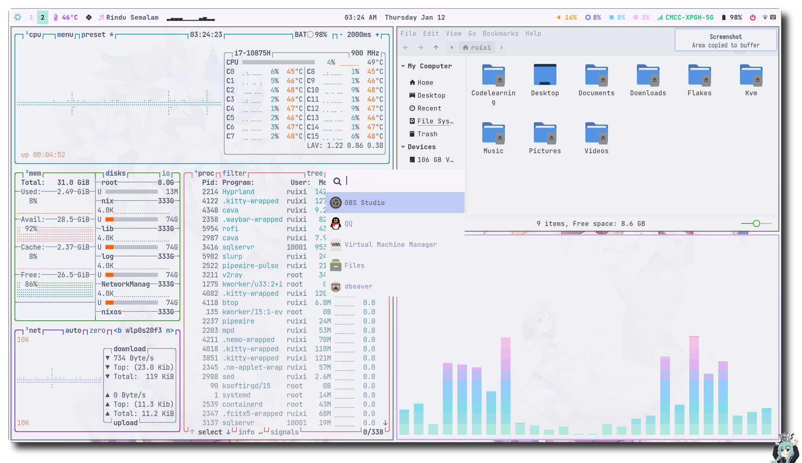
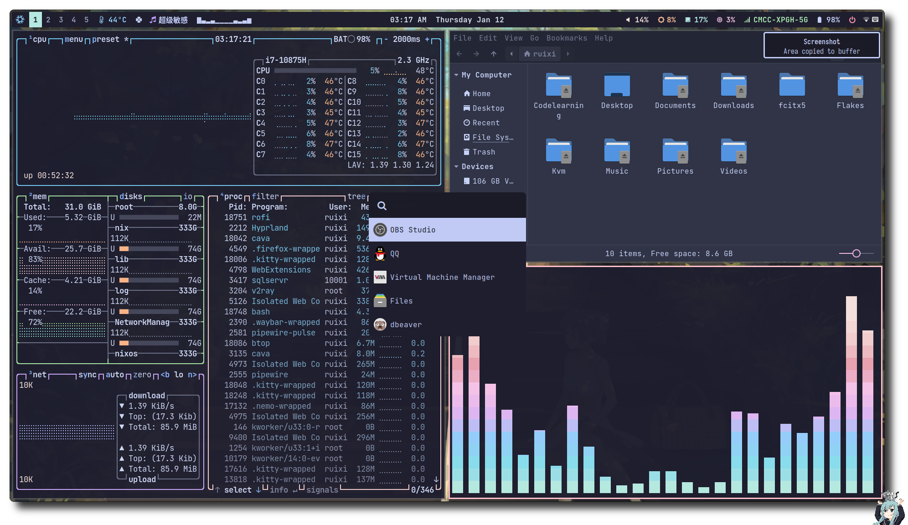

**简体中文（中国大陆）** | [English (UK)](README_en.md)

[](https://ruixi-rebirth.github.io) [](https://github.con/Ruixi-rebirth/nixos-config/actions/workflows/NixOS.yml)

<p align="center"></p>
<h2 align="center">Ruixi-rebirth's NixOS Config</h2>
<p align="center"></p>

https://user-images.githubusercontent.com/75824585/201473117-578af0df-e4ea-4dc9-91a6-c30281d46e7a.mp4

### 主题
**catppuccin-dark**


**catppuccin-light**


*安装主题两个任意选择一个即可：具体见[这里](https://github.com/Ruixi-rebirth/nixos-config/blob/f8b05ecb91723981637ed65e1cf30896f71d26c9/hosts/laptop/home.nix#L11-L12)*

### 屏幕截图
<details>
<summary><b>Click to expend</b></summary>




</details>

### 目录结构
```
.
├── flake.lock
├── flake.nix
├── hosts
│   ├── default.nix
│   ├── laptop
│   └── system.nix
├── modules
│   ├── desktop
│   ├── devlop
│   ├── editors
│   ├── environment
│   ├── fonts
│   ├── hardware
│   ├── programs
│   ├── scripts
│   ├── shell
│   ├── theme
│   └── virtualisation
├── overlays
│   └── default.nix
├── pkgs
│   ├── catppuccin-cursors
│   ├── catppuccin-gtk
│   └── default.nix
├── README_en.md
├── README.md
└── screenshot
    └── screenshot.png
```

### 如何安装?(root on tmpfs)
0. 假设我已经分好两个分区`/dev/nvme0n1p1` `/dev/nvme0n1p3`
1. 格式化分区
```bash
  mkfs.fat -F 32 /dev/nvme0n1p1 
  mkfs.ext4 /dev/nvme0n1p3
```
2. 挂载
```bash
  mount -t tmpfs none /mnt 
  mkdir -p /mnt/{boot,nix}
  mount /dev/nvme0n1p3 /mnt/nix
  mount /dev/nvme0n1p1 /mnt/boot 
```
3. 生成一个基本的配置 
```bash
  nixos-generate-config --root /mnt
```
4. 克隆仓库到本地
```bash
nix-shell -p git
git clone  https://github.com/Ruixi-rebirth/nixos-config.git /mnt/etc/nixos/Flakes 
```
5. 将 /mnt/etc/nixos 中的 `hardware-configuration.nix` 拷贝到 /mnt/etc/nixos/Flakes/hosts/laptop/hardware-configuration.nix
```bash 
cp /mnt/etc/nixos/hardware-configuration.nix /mnt/etc/nixos/Flakes/hosts/laptop/hardware-configuration.nix
```
6. 修改被覆盖后的 `hardware-configuration.nix`
```bash
nano /mnt/etc/nixos/Flakes/hosts/laptop/hardware-configuration.nix
```
```nix
...
#这只是一个例子
#请参考 `https://elis.nu/blog/2020/05/nixos-tmpfs-as-root/#step-4-1-configure-disks`

fileSystems."/" =
    { device = "none";
      fsType = "tmpfs";
      options = [ "defaults" "size=8G" "mode=755" ];
    };

  fileSystems."/nix" =
    { device = "/dev/disk/by-uuid/b0f7587b-1eb4-43ad-b4a1-e6385b8511ae";
      fsType = "ext4";
    };

  fileSystems."/boot" =
    { device = "/dev/disk/by-uuid/3C0D-7D32";
      fsType = "vfat";
    };
...
```
7. 进入克隆的仓库并移除 '/mnt/etc/nixos/Flakes/.git'
```bash 
cd /mnt/etc/nixos/Flakes && rm -rf .git
```
8. 修改用户 *root* 和 *ruixi* 的登陆密码,使用 `mkpasswd -m sha-512` 命令生成的hash密码将 `/mnt/etc/nixos/Flakes/hosts/laptop/default.nix` 中的 `users.users.<name>.hashedPassword` 的值替换掉
9. 安装
```bash
nixos-install --no-root-passwd --flake .#laptop

#或者指定源：
nixos-install --option substituters "https://mirrors.tuna.tsinghua.edu.cn/nix-channels/store" --no-root-passwd --flake .#laptop
```
10. 重启
```bash
reboot
```
11. 享受它吧！
