## 数据

```
描述事物的符号记录
```

## 数据库

```
长期存储在计算机内、有组织的、可共享的大量数据的集合
```

## DBMS(Database Manager System)

```
数据库管理软件。如mysql,sqlserver,mariadb,Access等等内部都内置了各种的DBMS,所以也称这些都是DBMS,换言之，目前流行的DBMS有mysql,sqlserver等等
```

## DBS

```
数据库系统也简称为数据库。由数据库，DBMS及其开发工具、应用程序(如学生管理系统的前台界面)、DBA及其用户构成
```

## 数据模型

```
(1)概念模型：按照用户的观点来对数据和信息建模（很重要，会影响到逻辑模型和物理模型）
(2)逻辑模型和物理模型：主要包括网状模型、层次模型、关系模型等，它是按照计算机系统的观点对数据建模。用于DBMS的实现
```

### 数据模型的组成要素

```
1.数据结构
2.数据操作
3.数据的约束条件
```

## 实体

```
如一个学生、老师与院系的工作关系等
```

## 属性

```
如学生实体中的姓名、学号等
```

## 码

```
唯一标识实体的属性集。如学生实体的学号
```

## 域

```
属性的取值范围。如性别域（男、女）
```

## 实体型

```
实体名及其属性名集合来抽象刻画同类实体。如学生(姓名 学号 班级)就是一个实体型
```

## 实体集

```
如全体学生
```

## 概念模型标识方法

```
E-R 方法 即实体-联系方法
```

## 数据库系统的三级模式

```
模式(逻辑模式)是全体数据，外模式(子模式)是全体数据中的某一部分，内模式也称存储模式
```

## 外模式/模式映像

```
定义了外模式与模式之间的对应关系
每个外模式都对应一个外模式/模式映像（映像数量多个）
映像定义通常包含在各自外模式的描述中
```

## 模式/内模式映像

```
定义了数据全局逻辑结构与存储结构之间的对应关系
数据库中模式/内模式映像是唯一的
该映像的定义通常包含在模式描述中
```

## 关系数据模型

其数据结构是一张二维的表格

## 候选码

```
能够被选为主码的属性或属性组，说明主码不唯一
```

## 主属性

> 定义：包含在任何候选码中的属性(主码一定是候选码，候选码不一定是主码，因为主码是人选的，是随机的)
> 例：比如，竞赛表（竞赛编号，竞赛名称，竞赛组织者） PS：竞赛名称和竞赛组织者都可以重复

> 很明显可以看出竞赛编号能够唯一标识整张竞赛表，因此候选码是竞赛编号，并且仅此一个候选码，其他属性都不能唯一标识整张表，所竞赛编号同时也是主码。

> 这时候判断一下这几个属性 or 属性组是否是主属性，（竞赛编号）（竞赛编号，竞赛名称）（竞赛名称，竞赛组织者），（竞赛编号）只有一个属性，这个属性是主码，主码必定为候选码，因此属性含有一个候选码，这个属性是主属性。（竞赛编号，竞赛名称）有两个属性，其中竞赛编号是候选码，而竞赛名称不是候选码，那他是啥呢~前面有提到了，因为它跟候选码在同一个属性组里，所以，竞赛名称是超码，回过头来，最后得出该属性组含有了一个候选码，因此该属性组中的各个属性都是主属性。（竞赛名称，竞赛组织者）有两个属性，可以看出这两个属性都不是候选码，因此这个属性组不包含候选码，属性组中中得各个元素称为非主属性。

## misc

```
主码=主键=主关键字，关键字=候选码 候选关键字=候选码中除去主码的其他候选码
```

## 分量

```
如在二位表格中的单元格的值。关系的分量必须是一个不可分的数据项(如工资被分为奖金、工龄、基本，这样对于关系来说是不规范的)
```

## 元组

```
表中的每行（即数据库中的每条记录）就是一个元组;元组的个数为基数
```

## 目（度）

```
属性个数，也即列数
```

## 关系模型中的三类完整性约束

```
1. 实体完整性
2. 参照完整性
3. 用户定义完整性
```

## 实体完整性

```
实体完整性规则规定基本关系的所有主属性不能取空值，当我给某个表设置主键时，由于给主属性设置了空值，始终创建不了主码
```

## 参照完整性

```
在关系模型中实体与实体之间的联系都是用关系来描述的，因此存在关系与关系之间的引用
```

> 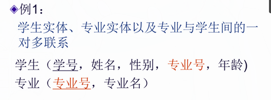 \
> 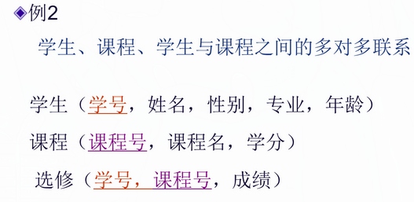 \
> 

> > _外码_ \
> > `设F是基本关系R中的一个或一组属性，但不是关系R的码。如果F与基本关系S中的主码K相对应，那么F是基本关系R的外码（外码取值可取空值，因为不是主属性;外码可取S中某个元组的主码值）` \
> > _参照关系_ \
> > `外码所在的关系，即关系R为参照关系` \
> > _被参照关系(目标关系)_ \
> > `关系S为参照关系`

> > 例 1\
> > 外码：专业&ensp;&ensp;&ensp;&ensp;参照关系:学生关系&ensp;&ensp;&ensp;&ensp;被参照关系：专业关系\
> > 例 2\
> > 外码：学号、课程号&ensp;&ensp;&ensp;&ensp;参照关系:选修&ensp;&ensp;&ensp;&ensp;被参照关系：学生关系、课程关系\
> > 例 3\
> > 外码：班长&ensp;&ensp;&ensp;&ensp;参照关系:学生关系&ensp;&ensp;&ensp;&ensp;被参照关系：学生关系

## 用户定义完整性

```
例：课程(课程号，课程名，学分) 主码为课程号
- “课程名”属性必须取唯一值
- 非主属性“课程名”不能取空值
- “学分”属性只能取值{1,2,3,4}
```

## 关系代数运算的分类

```
1.传统的集合运算：并、交、差、广义笛卡尔积
2.专门的关系运算：选择、投影、连接、除
```

## 运算符及其对应关系

| 运算符 |   含义   |
| :----: | :------: |
|   ∪    |    并    |
|   -    |    差    |
|   ∩    |    交    |
|   ×    | 笛卡尔积 |
|   σ    |   选择   |
|   π    |   投影   |
|   ⋈    |   连接   |
|   ÷    |    除    |

## 专门的关系运算

```
选择、投影、连接、除
```

## 记号

> R, t∈ R, t[A<sub>i</sub>]
>
> - 设关系模式为 R(A<sub>1</sub>,A<sub>2</sub>,……,A<sub>n</sub>)
> - t∈ R 表示 t 是 R 的一个元组
> - t[A<sub>i</sub>]表示元组 t 中对应属性 A<sub>i</sub>的一个分量(单元格的值)

> A, t[A], $\overline{A}$
> 若 A={A<sub>i1</sub>,A<sub>i2</sub>,……,A<sub>ik</sub>}
>
> - 其中 A 称为属性列或者域列
> - t[A]=([t[A<sub>i1</sub>],t[A<sub>i2</sub>],……,t[A<sub>ik</sub>])表示元组 t 在属性列 A 上诸分量的集合
> - $\overline{A}$表示{A<sub>1</sub>,A<sub>2</sub>,……,A<sub>n</sub>}中去掉{A<sub>i1</sub>,A<sub>i2</sub>,……,A<sub>ik</sub>}后剩余的属性列

> \
> 象集\
> 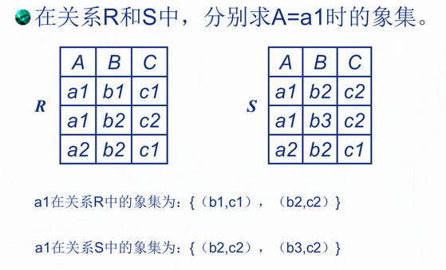

## 选择

> 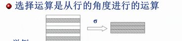
> |Sno|Sname|Ssex|Sage|Sdept|
> |---|---|---|---|---|
> |201215122|刘晨|女|19|IS|
> |201215125|张立|男|19|IS|
> |201215122|王敏|女|19|MA|
> |201215122|李勇|男|19|CS|
> |201215122|大地|男|20|IS|
>
> 例 1 查询信息系（IS）全体学生的信息\
> **$$\sigma\_{Sdept='IS'}(Student)$$** (字符串使用单引号)
> |Sno|Sname|Ssex|Sage|Sdept|
> |---|---|---|---|---|
> |201215122|刘晨|女|19|IS|
> |201215125|张立|男|19|IS|
> |201215122|大地|男|20|IS|

> 例 2 查询**信息系**年龄**小于 20**的学生信息\
> **$$\sigma\_{Sdept='IS'\wedge Sage<20}(Student)$$**
> |Sno|Sname|Ssex|Sage|Sdept|
> |---|---|---|---|---|
> |201215122|刘晨|女|19|IS|
> |201215125|张立|男|19|IS|

## 投影

> 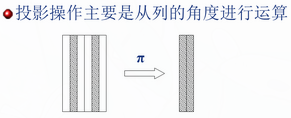
>
> _投影后不仅取消了原关系中的某些列，而且还可能取消某些元组(避免重复行)_\
>  例 3 求 Student 关系学生姓名和所在系两个属性上的投影：\
>  **$$\pi_{Sname,Sdept}(Student)$$**
> |Sname|Sdept|
> |---|---|
> |刘晨|IS|
> |张立|IS|
> |王敏|MA|
> |李勇|CS|
> |大地|IS|

> 例 4 查询学生关系 Student 中都有哪些系？(涉及去重)
>
> **$$\pi_{Sdept}(Student)$$**
> |Sdept|
> |---|
> |MA|
> |CS|
> |IS|
>
> 思考：查询信息系年龄<20 岁的学生学号、姓名、年龄？\
> **$$\pi_{Sno,Sname,Sage}(\sigma_{Sdept=‘IS’\wedge Sage<20}(Student))$$**

## 连接(join)

> **1.普通连接**
>
> 关系 R
> |A|B|C|
> |:---:|:---:|:---:|
> |a1|b1|5|
> |a1|b2|6|
> |a2|b3|8|
> |a2|b4|12|
>
> 关系 S
> |B|E|
> |:---:|:---:|
> |b1|3|
> |b2|7|
> |b3|10|
> |b3|2|
> |b5|2|
>
> \
> 两关系做笛卡尔积后结果为
> |A|R.B|C|S.B|E|
> |:---:|:---:|:---:|:---:|:---:|
> |a1|b1|5|b1|3|
> |a1|b1|5|b2|7|
> |a1|b1|5|b3|10|
> |a1|b1|5|b3|2|
> |a1|b1|5|b5|2|
> |a1|b2|6|b1|3|
> |a1|b2|6|b2|7|
> |a1|b2|6|b3|10|
> |a1|b2|6|b3|2|
> |a1|b2|6|b2|2|
> |a2|b3|8|b1|3|
> |a2|b3|8|b2|7|
> |a2|b3|8|b3|10|
> |a2|b3|8|b3|2|
> |a2|b3|8|b5|2|
> |a2|b4|12|b1|3|
> |a2|b2|12|b2|7|
> |a2|b2|12|b3|10|
> |a2|b2|12|b3|2|
> |a2|b2|12|b5|2|
>
> 根据**C<E**,筛选后得
> |A|R.B|C|S.B|E|
> |:---:|:---:|:---:|:---:|:---:|
> |a1|b1|5|b2|7|
> |a1|b1|5|b3|10|
> |a1|b2|6|b2|7|
> |a1|b2|6|b3|10|
> |a2|b3|8|b3|10|
>
> **2.等值连接**\
> 
>
> |  A  | R.B |  C  | S.B |  E  |
> | :-: | :-: | :-: | :-: | :-: |
> | a1  | b1  |  5  | b1  |  3  |
> | a1  | b2  |  6  | b2  |  7  |
> | a1  | b2  |  6  | b2  |  2  |
> | a2  | b3  |  8  | b3  | 10  |
> | a2  | b3  |  8  | b3  |  2  |
> | a2  | b2  | 12  | b2  |  7  |
>
> **3.自然连接**\
> `是一种特殊的等值连接`\
> 
>
> |  A  |  B  |  C  |  E  |
> | :-: | :-: | :-: | :-: |
> | a1  | b1  |  5  |  3  |
> | a1  | b2  |  6  |  7  |
> | a1  | b2  |  6  |  2  |
> | a2  | b3  |  8  | 10  |
> | a2  | b3  |  8  |  2  |
> | a2  | b2  | 12  |  7  |
>
> > **自然连接与等值连接区别:**
> >
> > 1.  等值连接中不要求相等属性值的属性名相同，而自然连接要求相等属性值的属性名必须相同，即两关系只有在同名属性才能进行自然连接。如上例 R 中的 C 列和 S 中的 E 列可进行等值连接，但因为属性名不同，不能进行自然连接。
> > 2.  等值连接不将重复属性去掉，而自然连接去掉重复属性，也可以说，自然连接是去掉重复列的等值连接。如上例 R 中的 B 列和 S 中的 B 列进行等值连接时，结果有两个重复的属性列 B,而进行自然连接时，结果只有一个属性列 B

## 选择、投影、(自然)连接综合例题

> \
> **$$\pi_{sno,sname}(\sigma_{cno=‘2’}(student\bowtie sc))$$**

## 除

> 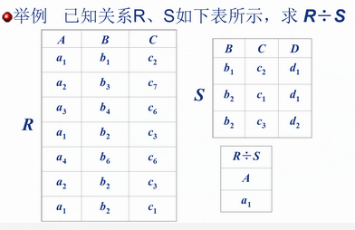 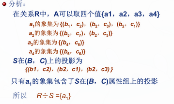

## 课后习题

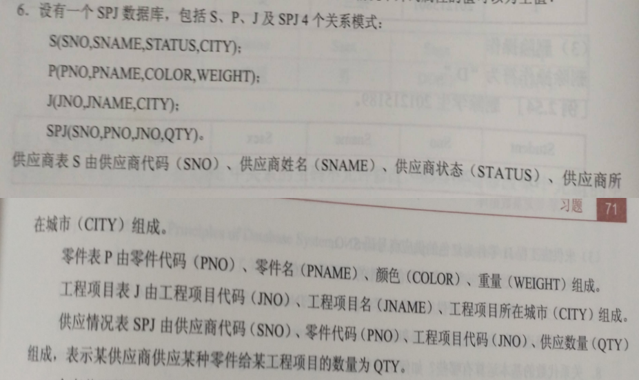

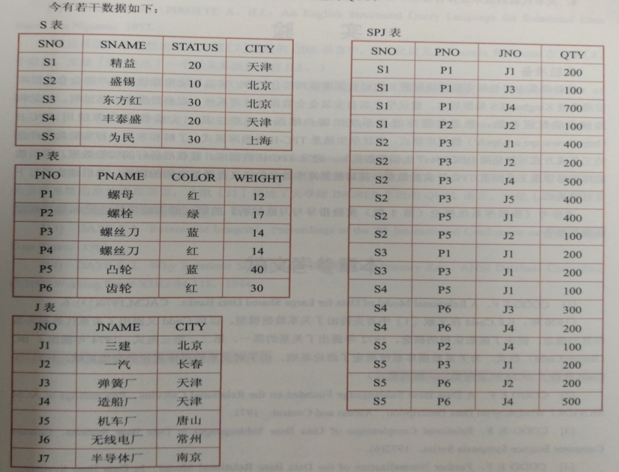

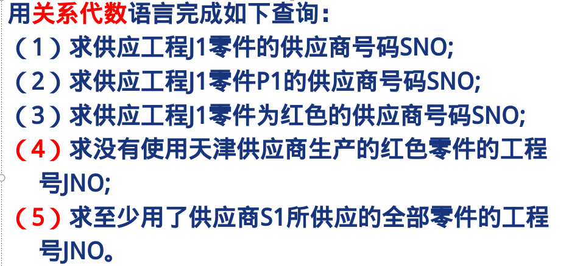

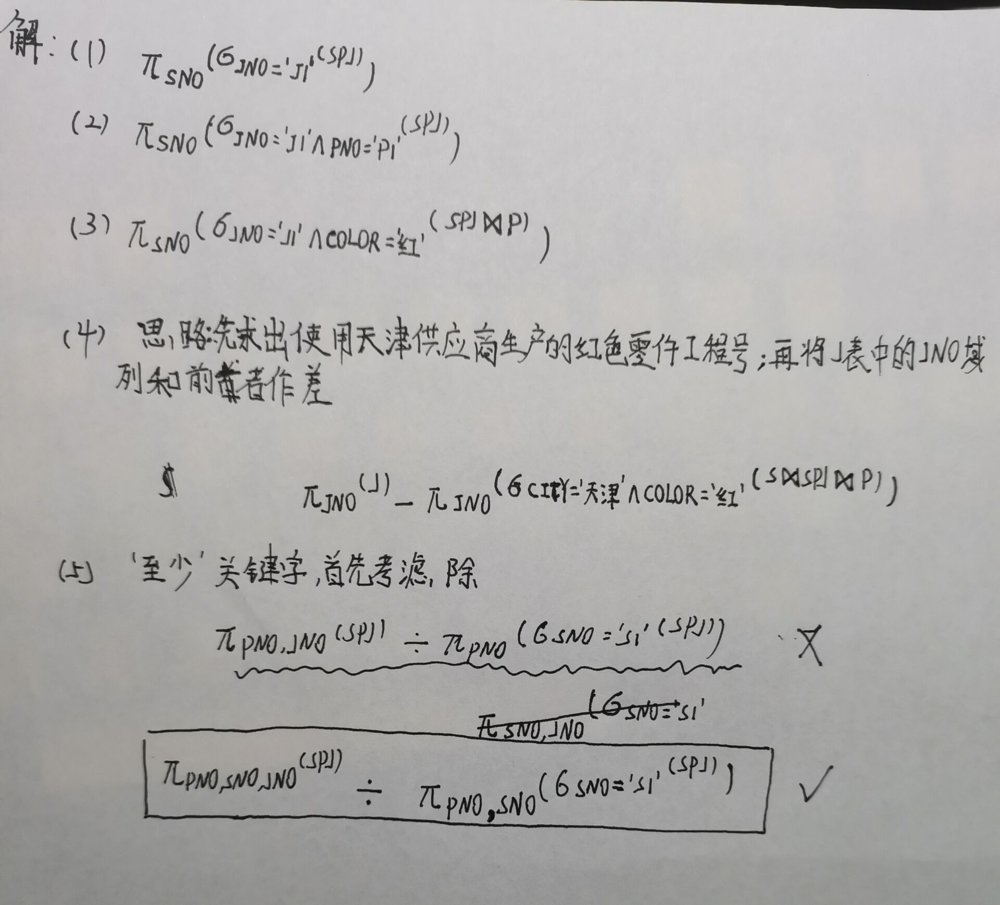
