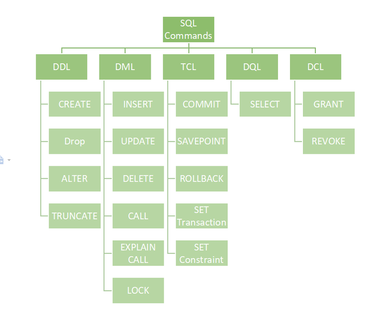

> 众所周知，结构化查询语言（SQL）是一种数据库语言，通过它我们可以对现有的数据库执行某些操作，也可以使用这种语言来创建数据库。 SQL 使用某些命令（如 Create、Drop、Insert 等）来执行所需的任务。
> 这些 SQL 命令主要分为四类：
>
> - **DDL** – 数据定义语言
> - **DQL** – 数据查询语言
> - **DML** – 数据操作语言
> - **DCL** – 数据控制语言
> - 尽管许多资源声称存在另一类 SQL 子句 **TCL** – 事务控制语言 。 因此，我们还将详细了解 **TCL**。

---

## DDL（数据定义语言）

DDL 或数据定义语言实际上由可用于定义数据库模式的 SQL 命令组成。 它只处理数据库模式的描述，并用于创建和修改数据库中的数据库对象的结构。DDL 是一组用于创建、修改和删除数据库结构而不是数据的 SQL 命令。 这些命令通常不被一般用户使用，他们应该通过应用程序访问数据库

DDL 命令列表：

- [CREATE](http://ruixi.me/p/mssql02_1/#create) ：此命令用于创建数据库或其对象（如表、索引、函数、视图、存储过程和触发器）。
- [DROP](http://ruixi.me/p/mssql02_1/#drop) ：此命令用于从数据库中删除对象。
- [ALTER](http://ruixi.me/p/mssql02_1/#alter) ： 这用于更改数据库的结构。
- [TRUNCATE](http://ruixi.me/p/mssql02_1/#truncate) ： 这用于从表中删除所有记录，包括删除为记录分配的所有空间。
- COMMENT ：用于向数据字典添加注释。
- RENAME ： 这用于重命名数据库中存在的对象。

| 操作对象 | 操作方式/创建   | 操作方式/删除 | 操作方式/修改 |
| -------- | --------------- | ------------- | ------------- |
| 数据库   | CREATE DATABASE | DROP DATABASE |               |
| 表       | CREATE TABLE    | DROP TABLE    | ALTER TABLE   |
| 视图     | CREATE VIEW     | DROP VIEW     |               |
| 索引     | CREATE INDEX    | DROP INDEX    |               |

## DQL（数据查询语言）

DQL 语句用于对模式对象中的数据执行查询。 DQL 命令的目的是根据传递给它的查询获取一些模式关系。 我们可以将 DQL 定义如下，它是 SQL 语句的一个组件，允许从数据库中获取数据并对其进行排序。 它包括 SELECT 语句。 此命令允许从数据库中获取数据以对其执行操作。 当对一个或多个表触发 SELECT 时，结果会编译到另一个临时表中，该表会显示或可能由程序（即前端）接收。

DQL 列表:

- SELECT ： 用于从数据库中检索数据。

## DML（数据操作语言）

处理数据库中存在的数据操作的 SQL 命令属于 DML 或数据操作语言，这包括大多数 SQL 语句。 它是控制对数据和数据库的访问的 SQL 语句的组件。 基本上，DCL 语句与 DML 语句组合在一起。

DML 命令列表：

- INSERT ：用于向表中插入数据。
- UPDATE ： 它用于更新表中的现有数据。
- [DELETE](http://ruixi.me/p/mssql02_1/#delete) ：用于从数据库表中删除记录。
- LOCK： 表控制并发。
- CALL： 调用 PL/SQL 或 JAVA 子程序。
- EXPLAIN PLAN： 描述数据的访问路径。

## DCL（数据控制语言）

DCL 包括 GRANT、REVOKE 等命令，主要处理数据库系统的权限、权限等控制。

DCL 命令列表：

- GRANT： 此命令授予用户访问数据库的权限。
- REVOKE： 此命令撤销用户使用 GRANT 命令赋予的访问权限。

## TCL（事务控制语言）

TCL 命令列表：

- COMMIT ： 提交事务。
- ROLLBACK ： 在发生任何错误的情况下回滚事务。
- SAVEPOINT ： 在事务中设置保存点。
- SET TRANSACTION： 指定交易的特征。

## MISC

支持 SQL 的 RDBMS 同样支持关系数据库三级模式

### 基本表

本身独立存放的表（模式），在 SQL 中一个关系对应一个基本表。基本表和索引对应存储文件（内模式）

### 视图

从一个或者几个基本表导出的表（外模式），是虚表，数据库中只是存放视图的定义而不存放视图对应的数据

### 建立与删除索引

索引的作用：加快查询速度
谁来建立索引：

- DBA 或表的属主
- 有些 DBMS 自动建立以下列上的索引：PRIMARY KEY,UNIQUE
  谁来维护索引：DBMS 自动完成
  如何引用索引：DBMS 自动选择是否使用索引以及使用哪些索引
