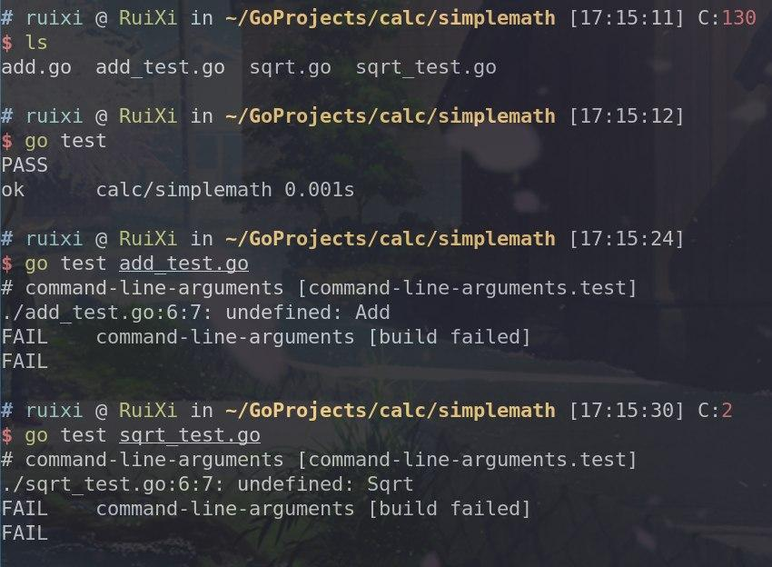

_**我的报错截图:**_

## 具体解决方案

很多人记录过怎么执行 go test 单个文件或者单个函数，但是要么对执行单文件用例存在函数或变量引用的场景避而不谈，要么提示调用了其它文件中的模块会报错。其实了解了 golang 命令程序的机制之后，这个问题就迎刃而解了。

# **阅读目录**

- [背景](#_label0)
- [根本原因](#_label1)
- [解决方法](#_label2)
- [总结](#_label3)

## 背景

很多人记录过怎么执行 go test 单个文件或者单个函数，但是要么对执行单文件用例存在函数或变量引用的场景避而不谈，要么提示调用了其它文件中的模块会报错。其实了解了 go test 命令的机制之后，这个问题就迎刃而解了。

也是一个同事向我求助我才知道有这样一个问题存在，因为场景特殊他只想执行我们的测试代码其中一个文件中的测试代码，因为调用的信息都在同一目录（package）下，原代码执行是不存在引用问题的，直接执行`go test`也是可以运行的，但是单独运行其中一个文件时，出现了下面的错误：

    bingo@Mac Interface_test$ go test -v getinfo_test.go
    # command-line-arguments
    ./getinfo_test.go:34:23: undefined: touch
    ./getinfo_test.go:35:23: undefined: verify
    ...
    FAIL	command-line-arguments [build failed]

这也许是很多数人会遇到的一个错误，搜索引擎上没有找到相关的信息，有的人做了相关的记录来提示后来人：执行单文件存在引用时会报错。

这可能也是使用 golang 做测试的弊端，因为发展时间不长，没有像 Python 或者 Java 那样成熟的社区；废话不多说，我们一起来看看这个问题为什么会发生。

## 根本原因

其实从看看上面的这段提示：`build failed`，构建失败，我们应该就能看出一下信息。go test 与其他的指定源码文件进行编译或运行的命令程序一样（参考：`go run`和`go build`），会为指定的源码文件生成一个虚拟代码包——“command-line-arguments”，对于运行这次测试的命令程序来说，测试源码文件`getinfo_test.go`是属于代码包“command-line-arguments”的，可是它引用了其他包中的数据并不属于代码包“command-line-arguments”，编译不通过，错误自然发生了。

## 解决方法

### 解决

知道了原因之后，解决的方法就出来了，**执行命令时加入这个测试文件需要引用的源码文件**，**在命令行后方的文件都会被加载到`command-line-arguments`中进行编译。**。示例如下：

    bingo@Mac Interface_test$ go test -v getinfo_test.go  lib.go
    ok      command-line-arguments  0.008s

### 多级引用或多个引用包的情况

如果对多个包存在引用关系，或者引用的包对当前目录的其他文件存在引用，也都是一样的方法，把他们加在命令后方即可。

## 总结

测试单个文件，一定要带上被测试的原文件，如果原文件有其他引用，也需一并带上。

(文章转载自[https://www.cnblogs.com/Detector/p/10010292.html](https://www.cnblogs.com/Detector/p/10010292.html))
